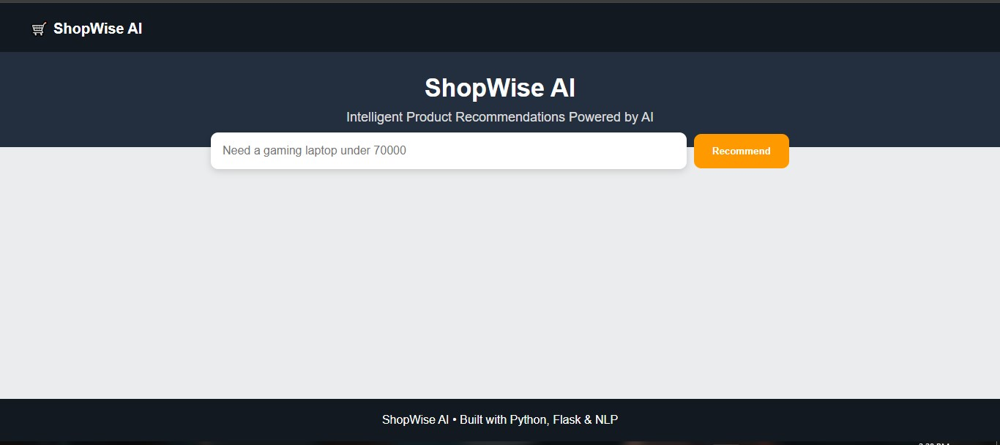
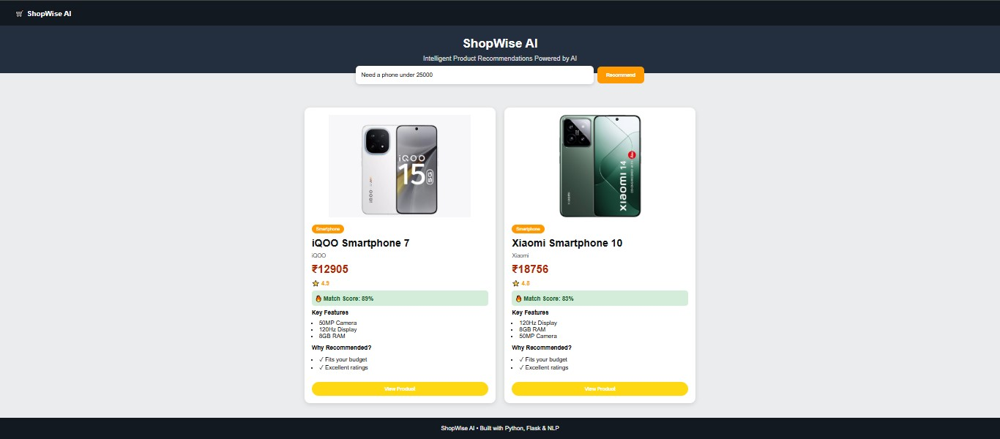

<p align="center">
  <h1 align="center">🛒 ShopWise AI</h1>
</p>

<p align="center">
  <b>Your Intelligent Shopping Copilot for Smarter Purchase Decisions.</b>
</p>

<p align="center">
  Flask • Python • Recommendation Engine • NLP-Based Query Understanding
</p>

<p align="center">
  <a href="https://shopwise-ai-7eyk.onrender.com">🚀 Live Demo</a>
</p>

---

## 🌟 Overview

ShopWise AI is an intelligent shopping recommendation system that helps users discover the most suitable products based on their requirements.

The application understands natural language queries such as budget, category, brand preferences, and intended purpose, then recommends the most relevant products using a custom recommendation engine and match scoring system.

Instead of manually browsing hundreds of products, users can simply describe what they need and receive personalized recommendations instantly.

---

## ✨ Key Features

✅ Natural Language Query Processing

✅ Budget-Aware Product Recommendations

✅ Category Detection

✅ Brand Recognition

✅ Purpose-Based Filtering

✅ Intelligent Match Scoring

✅ Product Ranking System

✅ Product Image Integration

✅ Interactive Flask Web Application

✅ Responsive User Interface

---

## 📸 Product Demo

### Home Page



### AI Recommendations



---

## 🧠 Recommendation Engine Workflow

```text
User Requirement
        │
        ▼
Query Understanding
        │
        ▼
Budget Extraction
Category Detection
Brand Detection
Purpose Detection
        │
        ▼
Product Filtering
        │
        ▼
Match Score Calculation
        │
        ▼
Top Recommendations
```

---

## 💬 Example Queries

```text
Need a gaming laptop under 70000
```

```text
Need a phone under 25000
```

```text
Need earbuds under 5000
```

```text
Need a camera for photography under 80000
```

---

## 🛠️ Technology Stack

| Technology  | Purpose                |
| ----------- | ---------------------- |
| Python      | Backend Logic          |
| Flask       | Web Framework          |
| Pandas      | Data Processing        |
| HTML        | Frontend Structure     |
| CSS         | User Interface Styling |
| CSV Dataset | Product Knowledge Base |

---

## 📂 Project Structure

```text
ShopWise-AI
│
├── static
│   ├── images
│   └── style.css
│
├── templates
│   └── index.html
│
├── app.py
├── shopping_engine.py
├── generate_dataset.py
├── products.csv
├── requirements.txt
└── README.md
```

---

## ⚙️ Installation

### Clone Repository

```bash
git clone https://github.com/Madhura-Malap/YOUR_REPOSITORY_NAME.git
```

### Install Dependencies

```bash
pip install -r requirements.txt
```

### Run Application

```bash
python app.py
```

Open:

```text
http://127.0.0.1:5000
```

---

## 🎯 Real-World Applications

* E-commerce Product Discovery
* Shopping Assistants
* Product Recommendation Systems
* Customer Decision Support Tools
* Personalized Shopping Platforms

---

## 🚀 Future Roadmap

* Real-time product data integration
* Personalized recommendations
* Product comparison engine
* Machine Learning ranking models
* User behavior tracking
* Wishlist functionality
* Cloud deployment
* E-commerce API integration

---

## 💡 Learning Outcomes

Through this project, I gained practical experience in:

* Recommendation Systems
* Query Processing
* Product Ranking Algorithms
* Flask Web Development
* Dataset Handling with Pandas
* Frontend and Backend Integration
* User-Centric Product Design

---

## 👩‍💻 Author

### Madhura Malap

Computer Science Engineering Student | Aspiring AI/ML Engineer
eveloped to explore recommendation systems, natural language processing, and full-stack application development using Python and Flask.
